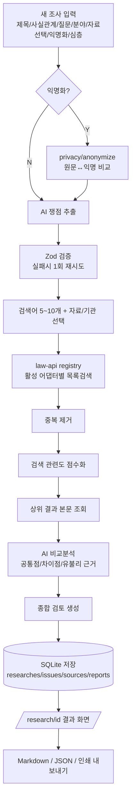

# 에이블로우 데스크(AbleLaw Desk) 구현 계획서 (implementation-plan.md)

## 1. 제품 정의

사용자가 입력한 상황(사업/생활/가족/재산/노동/세금/투자/개인정보)을 분석하여, 국가법령정보 공동활용 Open API에서 관련 **현행법령·판례**(및 확장 자료)를 검색하고, 내 질문과의 **공통점·차이점**을 정리하는 **개인용 로컬 조사 보조 도구**.

- ❌ 법률상담·합법/불법 확정판정·승소가능성 예측 도구가 아님
- ✅ 자료 검색 + 사실관계 비교 정리 도구
- 로컬 전용(`http://localhost:3000`), 회원가입/외부배포 없음

## 2. 기술 스택 결정

| 영역 | 선택 | 이유 |
|---|---|---|
| 프레임워크 | Next.js 15 (App Router) + TypeScript | 요구사항 명시 |
| 스타일 | Tailwind CSS | 요구사항 명시 |
| DB | SQLite + **Drizzle ORM** | Prisma 대비 설정 단순, better-sqlite3와 결합 시 로컬 파일 DB에 가장 가벼움 → "더 단순한 것" 기준 충족 |
| SQLite 드라이버 | better-sqlite3 | 동기 API, 로컬 단일 사용자에 적합 |
| AI | Claude API 우선, provider 추상화 | 요구사항 명시 (OpenAI 확장 대비) |
| 검증 | Zod | AI JSON 응답 스키마 검증 |
| XML 파싱 | fast-xml-parser | 법령 API XML 응답 파싱 |

## 3. 폴더 구조

```
ablelaw-desk/
├─ docs/
│  ├─ api-targets.md            # 공식 API 조사 결과
│  └─ implementation-plan.md    # 본 문서
├─ public/
├─ drizzle/                     # 마이그레이션 산출물
├─ data/                        # ablelaw.db (gitignore)
├─ .env.example
├─ .env.local                   # 실제 키 (gitignore)
├─ drizzle.config.ts
├─ next.config.ts
├─ tailwind.config.ts
├─ tsconfig.json
├─ package.json
└─ src/
   ├─ app/
   │  ├─ layout.tsx
   │  ├─ globals.css
   │  ├─ page.tsx                       # 대시보드 /
   │  ├─ research/new/page.tsx          # 새 조사
   │  ├─ research/[id]/page.tsx         # 조사 결과
   │  ├─ history/page.tsx               # 조사 기록
   │  ├─ settings/page.tsx              # 설정
   │  └─ api/
   │     ├─ settings/route.ts           # 설정 저장/조회
   │     ├─ settings/test/route.ts      # API 연결 테스트
   │     ├─ analyze/route.ts            # AI 사전 분석(쟁점 추출)
   │     ├─ anonymize/route.ts          # 개인정보 익명화
   │     ├─ research/route.ts           # 조사 실행 파이프라인
   │     ├─ research/[id]/route.ts      # 조회/수정/삭제
   │     └─ research/[id]/export/route.ts # md/json 내보내기
   ├─ components/                       # UI 컴포넌트 (상태별 UI, 면책 등)
   ├─ lib/
   │  ├─ law-api/
   │  │  ├─ client.ts                   # 공통 HTTP 클라이언트(재시도/타임아웃)
   │  │  ├─ registry.ts                 # 자료유형 등록/enabled 플래그
   │  │  ├─ normalize.ts                # → NormalizedLegalSource
   │  │  ├─ types.ts                    # target/필드 타입
   │  │  └─ adapters/
   │  │     ├─ law.ts                   # 현행법령(target=law) ✅
   │  │     ├─ prec.ts                  # 판례(target=prec) ✅
   │  │     └─ (detc/expc/decc ... 확장)
   │  ├─ ai/
   │  │  ├─ provider.ts                 # AIProvider 인터페이스
   │  │  ├─ anthropic.ts                # Claude 구현
   │  │  ├─ openai.ts                   # (스텁, 추후)
   │  │  ├─ schemas.ts                  # Zod 스키마
   │  │  └─ prompts.ts                  # 쟁점추출/비교 프롬프트
   │  ├─ privacy/anonymize.ts           # 개인정보 탐지·치환
   │  ├─ search/pipeline.ts             # 검색 절차 오케스트레이션
   │  ├─ search/score.ts                # 검색 관련도 점수화
   │  ├─ db/
   │  │  ├─ index.ts                    # drizzle 인스턴스
   │  │  ├─ schema.ts                   # 테이블 정의
   │  │  └─ settings.ts                 # 설정 저장(로컬)
   │  └─ export/markdown.ts             # md 변환
   └─ types/                            # 공용 타입
```

## 4. 데이터 흐름



## 5. 데이터베이스 스키마 (SQLite)

- **researches**: id, title, facts(원문), facts_anonymized, question, field, sources(json), anonymize(bool), deep_search(bool), status, favorite(bool), tags(json), created_at, updated_at
- **research_issues**: id, research_id(fk), confirmed_facts(json), unclear_facts(json), key_issues(json), agencies(json), keywords(json), keyword_combos(json), recommended_sources(json), followup_questions(json)
- **source_results**: id, research_id(fk), source_type, agency, source_id, title, case_number, decision_date, summary, original_text, related_laws(json), source_url, relevance_score, ai_similarities(json), ai_differences(json)
- **research_reports**: id, research_id(fk), question_summary, favorable_points(json), unfavorable_points(json), additional_checks(json), expert_questions(json), overall_review(text), created_at

## 6. 핵심 타입 — NormalizedLegalSource

```ts
interface NormalizedLegalSource {
  sourceType: 'law' | 'prec' | 'detc' | 'expc' | 'decc' | string;
  agency: string;         // 소관부처/법원명
  sourceId: string;       // 법령ID / 판례일련번호
  title: string;          // 법령명 / 사건명
  caseNumber?: string;    // 사건번호
  decisionDate?: string;  // 선고일자/공포일자
  summary?: string;       // 판결요지 등 (원문 요지)
  originalText?: string;  // 본문
  relatedLaws?: string[]; // 참조조문/관련법령
  sourceUrl: string;      // 상세링크
}
```

## 7. 단계별 계획 / 우선순위 / 리스크

| 단계 | 범위 | 완료 기준 |
|---|---|---|
| **1** | 계획·아키텍처·API 조사 문서화 (본 산출물) | docs 2종 작성 |
| **2** | Next.js 골격 + 설정 화면 + law-api 구조 + 면책 + README | dev 서버 기동, /settings 동작, 연결 테스트 |
| **3** | 법령·판례 어댑터 + 새 조사 + 익명화 + AI 쟁점추출/비교 + 결과화면 | 테스트 질문 검색·비교 동작 |
| **4** | 저장/수정/기록/즐겨찾기/태그 + md·json 내보내기 + 상태 UI + 검증 | typecheck/lint 통과, 3개 테스트질문 E2E |

### 리스크
1. **API 인증값(OC) 미보유** → 실제 호출 불가. 설정에서 OC 입력받고, 미입력 시 명확한 오류 UI. 개발 중에는 XML 응답 픽스처로 파서 검증.
2. **AI JSON 파싱 실패** → 1회 재시도 후 사용자 오류 표시(요구사항 반영).
3. **확장 자료 target 미확인** → registry `enabled:false`, README 미구현 섹션 명시.
4. **XML 한글 필드 키** → normalize 계층에서만 매핑, 상위는 영문 타입만 사용.
5. **법적 결론 오인 방지** → 점수는 "검색 관련도"로만 표기, 모든 화면/보고서에 면책 표시.

## 8. 품질 게이트 (매 단계)
`npm run dev` 기동 → `npm run typecheck`(tsc --noEmit) → `npm run lint` → 주요 기능 수동 확인.
